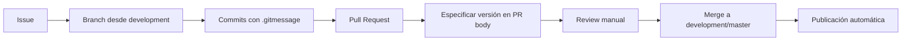

# Guía de Contribución - MauiPdfGenerator

Esta guía te ayuda a contribuir efectivamente al proyecto, enfocándose en cómo funciona el repositorio actualmente.

---

## Índice Rápido

| ¿Qué quiero hacer? | Ir a sección |
|--------------------|--------------|
| Entender el estado actual | [1. Estado Actual](#1-estado-actual-del-proyecto) |
| Contribuir código | [2. Flujo de Contribución](#2-flujo-de-contribución) |
| Crear un Pull Request | [3. Guía de Pull Requests](#3-guía-de-pull-requests) |
| Entender el proyecto | [4. Estructura del Proyecto](#4-estructura-del-proyecto) |
| Comandos útiles | [5. Comandos y Referencias](#5-comandos-y-referencias) |
| Ver mejoras futuras | [6. Roadmap de Mejoras](#6-roadmap-de-mejoras) |

---

## 1. Estado Actual del Proyecto

### ✅ Características Implementadas

| Característica | Estado | Detalles |
|----------------|--------|----------|
| **Publicación de paquetes** | ✅ Funcional | Workflows `dev-release.yml` y `prod-release.yml` |
| **Plantillas de Issues** | ✅ Disponibles | Bug report, feature request, maintenance, config |
| **Commit template** | ✅ Configurado | `.gitmessage` para commits estructurados |
| **Integración NuGet** | ✅ Activa | Publicación automática a NuGet.org |

### ⚠️ Características Parciales

| Característica | Estado | Limitación |
|----------------|--------|-------------|
| **Versionamiento** | ⚠️ Manual | Requiere especificar versión en PR body |
| **Validación de PRs** | ⚠️ Desactivada | `pr-validation.yml.disabled` está inactivo |
| **Branch Protection** | ⚠️ No verificado | Puede no estar configurado |

### ❌ Características No Implementadas

| Característica | Estado | Alternativa actual |
|----------------|--------|-------------------|
| **Scripts de versionamiento** | ❌ No existen | Extracción manual desde PR body |
| **GitHub Artifacts** | ❌ No usados | Versiones manejadas en .csproj |
| **Sistema de fallback** | ❌ No implementado | Proceso manual actual |

---

## 2. Flujo de Contribución

### 2.1 Proceso Actual (Manual)



### 2.2 Paso a Paso

1. **Crear Issue**: Usa las plantillas disponibles
2. **Crear Branch**: Desde `development`
   ```bash
   git checkout development
   git pull origin development
   git checkout -b feature/42-descripcion-corta
   ```
3. **Desarrollar**: Usa commits con estructura estándar
4. **Crear PR**: Con versión especificada en formato especial
5. **Merge**: Después de review manual
6. **Publicación**: Automática vía workflows

---

## 3. Guía de Pull Requests

### 3.1 Formato del PR Body

Los workflows actuales extraen la versión del PR body usando este formato:

```markdown
## Version Information
- Core: 1.5.12
- SourceGen: 1.3.4
```

### 3.2 Estructura de Commits

Usa el template configurado (ejecuta `git config commit.template .gitmessage`):

```
<tipo>[alcance]: <descripción>

[cuerpo opcional]

[footer opcional]
```

**Tipos disponibles:**
- `feat:` Nueva funcionalidad (bump MINOR)
- `fix:` Corrección de bug (bump PATCH)  
- `feat!:` / `fix!:` Cambio incompatible (bump MAJOR)
- `docs:`, `test:`, `refactor:`, `perf:`, `build:`, `ci:`, `chore:` (sin bump)

**Alcances:**
- `core`: Cambios en `MauiPdfGenerator/`
- `sourcegen`: Cambios en `MauiPdfGenerator.SourceGenerators/`
- `internal-task`: Cambios en `Sample/`, `.github/`, `Docs/`

### 3.3 Ejemplo de PR Completo

```markdown
Closes #42

## Changes
- feat(core): add PDF table rendering support
- feat(sourcegen): update generator for table types

## Version Information
- Core: 1.6.0
- SourceGen: 1.4.0
```

---

## 4. Estructura del Proyecto

### 4.1 Paquetes NuGet

| Paquete | Proyecto | Publicación |
|---------|----------|-------------|
| `RandAMediaLabGroup.MauiPdfGenerator` | `MauiPdfGenerator/` | ✅ Automática |
| `RandAMediaLabGroup.MauiPdfGenerator.SourceGenerators` | `MauiPdfGenerator.SourceGenerators/` | ✅ Automática |

### 4.2 Proyectos en la Solución

```
MauiPdfGenerator.sln
├── MauiPdfGenerator/              # Core package
├── MauiPdfGenerator.SourceGenerators/  # Roslyn analyzers
├── Sample/                        # Aplicación de ejemplo
└── MauiPdfGenerator.IntegrationTests/  # Tests de integración
```

### 4.3 Workflows Activos

| Workflow | Trigger | Función |
|----------|---------|---------|
| `dev-release.yml` | PR merged to `development` | Publica versiones preview |
| `prod-release.yml` | PR merged to `master` | Publica versiones estables |
| `sync-labels.yml` | Manual/Diario | Sincroniza labels de GitHub |

---

## 5. Comandos y Referencias

### 5.1 Configuración Inicial

```bash
# Configurar template de commits (una sola vez)
git config commit.template .gitmessage

# Verificar configuración remota
git remote -v
```

### 5.2 Flujo de Desarrollo

```bash
# Sincronizar con development
git checkout development
git pull origin development

# Crear nuevo branch para Issue #42
git checkout -b feature/42-add-table-support

# Hacer commits
git add .
git commit  # Usará el template automáticamente

# Push al branch remoto
git push origin feature/42-add-table-support

# Crear PR en GitHub (usa la web o gh CLI)
gh pr create --title "feat: add PDF table support" --body "Closes #42"
```

### 5.3 Comandos de Verificación

```bash
# Ver commits desde última versión
git log --oneline --grep="^feat\|^fix"

# Ver estructura del proyecto
find . -name "*.csproj" | head -10

# Ver workflows disponibles
ls -la .github/workflows/
```

---

## 6. Roadmap de Mejoras

### 6.1 Características Planificadas

| Mejora | Prioridad | Impacto |
|--------|-----------|---------|
| **PR Validation automático** | Alta | Calidad de código |
| **Scripts de versionamiento** | Alta | Reducción de errores manuales |
| **Branch Protection estricto** | Media | Seguridad del flujo |
| **GitHub Artifacts integration** | Baja | Optimización de build |

### 6.2 Cómo Contribuir a las Mejoras

1. **Para PR Validation**: Habilitar `pr-validation.yml.disabled`
2. **Para Versionamiento Automático**: Implementar scripts PowerShell
3. **Para Branch Protection**: Configurar reglas en GitHub Settings
4. **Para Artifacts**: Modificar workflows para usar artifacts

### 6.3 Estado de Implementación

- **Phase 1** (Actual): Publicación manual funcional
- **Phase 2** (Planeado): Validación automática de PRs
- **Phase 3** (Futuro): Versionamiento completamente automático

---

## Preguntas Frecuentes

**Q: ¿Por qué debo especificar la versión manualmente?**
A: Los workflows actuales no tienen implementado el cálculo automático. Esto está planificado para Phase 2.

**Q: ¿Puedo hacer push directo a development/master?**
A: Técnicamente posible si no hay Branch Protection configurado, pero no recomendado. Usa siempre PRs.

**Q: ¿Qué pasa si olvido especificar la versión en el PR?**
A: El workflow fallará. Necesitas editar el PR body con la información de versión y reintentar.

**Q: ¿Cómo sé si mi PR afecta a qué paquete?**
A: Revisa los scopes: `core` afecta al paquete principal, `sourcegen` al generador, `internal-task` no publica paquetes.

---

## Soporte

- **Issues**: Para bugs y feature requests
- **Discussions**: Para preguntas generales
- **Wiki**: Para documentación detallada
- **Email**: Para asuntos privados

Gracias por contribuir a MauiPdfGenerator! 🚀